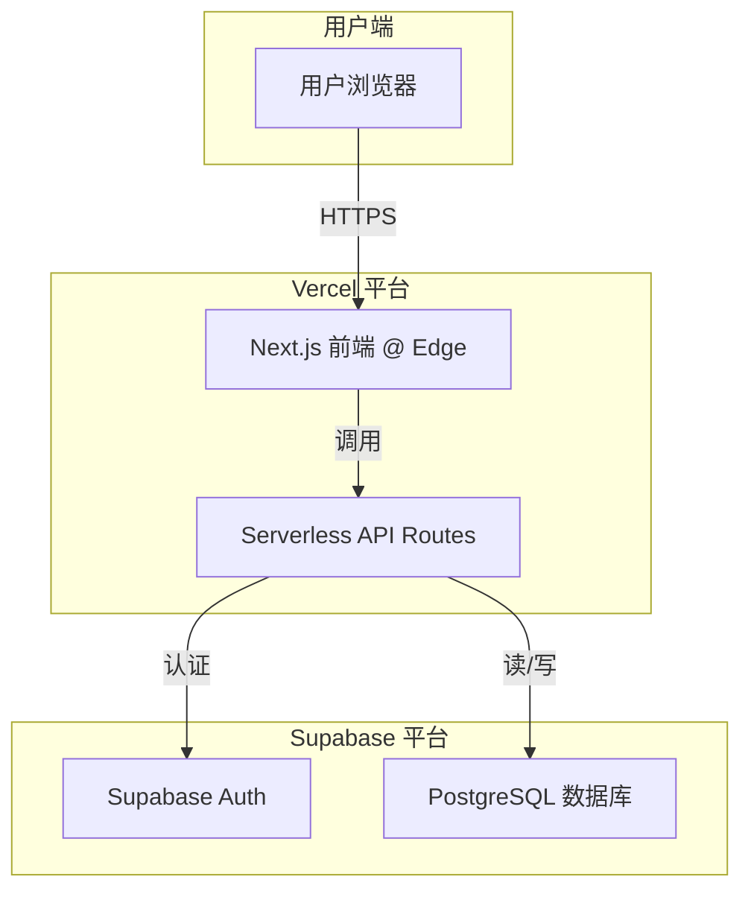

# 2. 高层架构

## 技术摘要
LingoLeap 将采用现代化的 **Jamstack** 架构风格进行构建。前端将是一个使用 **Next.js** 构建的混合渲染应用，托管在 **Vercel** 平台上。后端逻辑将通过部署在 Vercel 上的 **Serverless Functions** (tRPC 路由) 来实现，并与 **Supabase** 进行交互（后者提供数据库、认证等服务）。整体采用 **Monorepo** 结构进行管理。此架构旨在实现 PRD 中提出的快速迭代、低成本运营和高可扩展性的目标。

## 平台与基础设施选择
* **平台**: Vercel + Supabase
* **关键服务**: Vercel (托管, Serverless Functions, CI/CD), Supabase (PostgreSQL, Auth)
* **部署区域**: Vercel 的全球边缘网络

## 代码仓库结构
* **结构**: Monorepo (单一代码库)
* **Monorepo 工具**: npm Workspaces

## 高层架构图

## 架构模式

  * **Jamstack 架构**: 实现最佳性能和可扩展性。
  * **组件化 UI**: 使用 React 和 Chakra UI 提高开发效率。
  * **仓库模式**: 在后端服务中抽象数据访问逻辑。
  * **类型安全的端到端 API**: 使用 tRPC 消除前后端集成错误。
