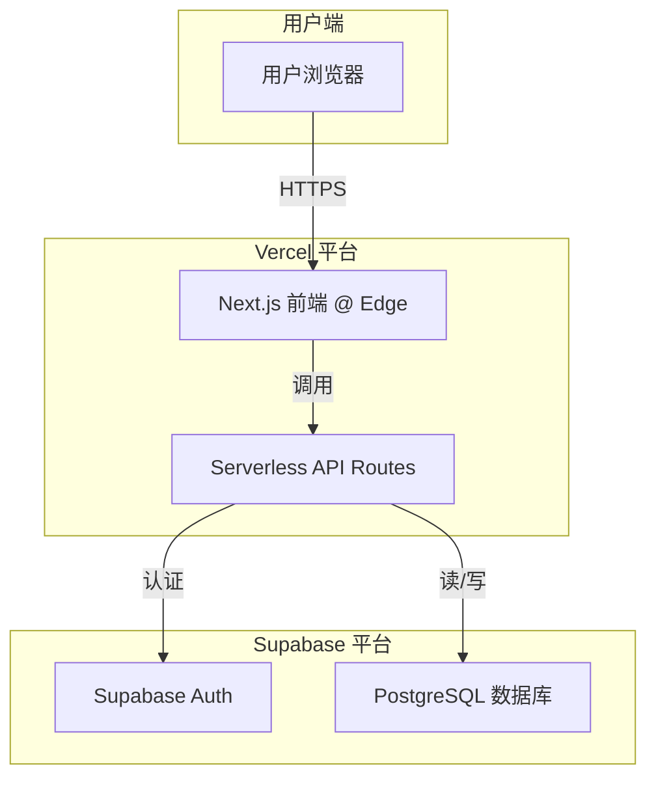

# LingoLeap 全栈架构文档

* **版本**: 1.0
* **日期**: 2025年9月9日
* **作者**: Winston (Architect)

## 1. 引言

本文档概述了 LingoLeap 的完整全栈架构，包括后端系统、前端实现及其集成方式。它将作为 AI 驱动开发过程中唯一的、权威的技术蓝图，以确保整个技术栈的一致性。这种统一的方法将传统上分离的后端和前端架构文档合并，旨在简化现代全栈应用的开发流程。

### 启动模板或现有项目
本项目为全新的（Greenfield）项目。我们同意使用 **`create-t3-app` (T3 Stack)** 作为项目的起点，因为它集成了我们已选择的技术（Next.js, TypeScript），并包含了许多最佳实践。

### 变更日志
| 日期 | 版本 | 描述 | 作者 |
| --- | --- | --- | --- |
| 2025年9月9日 | 1.0 | 初始架构文档创建 | Winston (Architect) |

## 2. 高层架构

### 技术摘要
LingoLeap 将采用现代化的 **Jamstack** 架构风格进行构建。前端将是一个使用 **Next.js** 构建的混合渲染应用，托管在 **Vercel** 平台上。后端逻辑将通过部署在 Vercel 上的 **Serverless Functions** (tRPC 路由) 来实现，并与 **Supabase** 进行交互（后者提供数据库、认证等服务）。整体采用 **Monorepo** 结构进行管理。此架构旨在实现 PRD 中提出的快速迭代、低成本运营和高可扩展性的目标。

### 平台与基础设施选择
* **平台**: Vercel + Supabase
* **关键服务**: Vercel (托管, Serverless Functions, CI/CD), Supabase (PostgreSQL, Auth)
* **部署区域**: Vercel 的全球边缘网络

### 代码仓库结构
* **结构**: Monorepo (单一代码库)
* **Monorepo 工具**: npm Workspaces

### 高层架构图


### 架构模式

  * **Jamstack 架构**: 实现最佳性能和可扩展性。
  * **组件化 UI**: 使用 React 和 Chakra UI 提高开发效率。
  * **仓库模式**: 在后端服务中抽象数据访问逻辑。
  * **类型安全的端到端 API**: 使用 tRPC 消除前后端集成错误。

## 3. 技术栈

| 类别 | 技术 | 版本 | 目的 | 理由 |
| --- | --- | --- | --- | --- |
| **前端语言** | TypeScript | \~5.3.3 | 提供类型安全 | 减少运行时错误，改善开发者体验 |
| **前端框架** | Next.js | \~14.1.0 | 应用框架 | 提供混合渲染（SSR/SSG）、路由和性能优化 |
| **UI 组件库** | Chakra UI | \~2.8.2 | UI 组件 | 提供一套可访问、可组合的 React 组件，加速 UI 开发 |
| **状态管理** | Zustand | \~4.5.0 | 客户端状态管理 | 轻量、简洁，样板代码少，易于上手 |
| **后端语言** | TypeScript | \~5.3.3 | 提供类型安全 | 与前端统一语言，简化开发 |
| **后端框架** | Next.js API Routes | \~14.1.0 | Serverless 后端 | 与前端框架集成，简化部署，按需扩展 |
| **API 风格** | tRPC | \~10.45.0 | 端到端类型安全 API | 无需代码生成即可在前后端共享类型，消除API集成错误 |
| **数据库** | PostgreSQL | 15.x | 主数据库 | 由 Supabase 提供，功能强大，稳定可靠 |
| **文件存储** | Supabase Storage | latest | 存储用户上传文件 | 与 Supabase 生态系统无缝集成 |
| **认证** | Supabase Auth | latest | 用户认证和授权 | 提供完整的用户管理、社交登录和行级安全策略 |
| **前端测试** | Jest & RTL | \~29.x | 组件和单元测试 | React 社区标准，专注于用户行为测试 |
| **后端测试** | Vitest | \~1.2.0 | API 和单元测试 | 现代、快速的测试框架，与 TypeScript 兼容性好 |
| **E2E 测试** | Playwright | \~1.41.0 | 端到端流程测试 | 强大、可靠的跨浏览器测试框架 |
| **CI/CD** | Vercel | N/A | 持续集成与部署 | 与 Next.js 无缝集成，提供 Git 推送即部署功能 |
| **监控** | Vercel Analytics | N/A | 性能和用户分析 | 开箱即用，提供核心 Web 指标和流量数据 |
| **日志** | Vercel Log Drains | N/A | 日志管理 | 实时查看 Serverless Functions 的日志输出 |

## 4. 数据模型

### Profile

  * **目的**: 存储与用户相关的公开信息，并补充 Supabase Auth 提供的认证数据。
  * **TypeScript Interface**:
    ```typescript
    export interface Profile {
      id: string; // Corresponds to Supabase user ID
      updated_at: string;
      username: string | null;
      full_name: string | null;
      avatar_url: string | null;
      learning_streak: number;
    }
    ```
  * **关系**: 与 `auth.users` 表一对一关联 (via `id`)。

### Deck (单词卡片集)

  * **目的**: 表示一个可供学习的单词集合。
  * **TypeScript Interface**:
    ```typescript
    export interface Deck {
      id: number;
      created_at: string;
      title: string;
      description: string | null;
      language: string;
    }
    ```
  * **关系**: 一个 Deck 包含多个 `Word` (一对多)。

### Word (单词)

  * **目的**: 表示卡片集中的一个具体单词或短语。
  * **TypeScript Interface**:
    ```typescript
    export interface Word {
      id: number;
      created_at: string;
      deck_id: number; // Foreign key to Deck
      original_word: string;
      translation: string;
      example_sentence: string | null;
    }
    ```
  * **关系**: 多个 Word 属于一个 `Deck` (多对一)。

### QuizResult (测试结果)

  * **目的**: 记录用户完成一次特定卡片集测试的历史成绩。
  * **TypeScript Interface**:
    ```typescript
    export interface QuizResult {
      id: number;
      created_at: string;
      user_id: string; // Foreign key to Profile/User
      deck_id: number; // Foreign key to Deck
      score: number; // e.g., 85 for 85%
    }
    ```
  * **关系**: 多个 `QuizResult` 属于一个 `Profile` 和一个 `Deck` (多对一)。

### UserWordMastery (用户单词掌握度)

  * **目的**: 追踪单个用户对单个单词的掌握程度。
  * **TypeScript Interface**:
    ```typescript
    export interface UserWordMastery {
      id: number;
      user_id: string; // Foreign key to Profile/User
      word_id: number; // Foreign key to Word
      mastery_level: number; // e.g., 0-5 scale
      last_reviewed_at: string;
    }
    ```
  * **关系**: 连接 `Profile` 和 `Word` 的多对多关系的联结表。

## 5. API 规范

### tRPC 路由定义

```typescript
import { z } from 'zod';
import { createTRPCRouter, publicProcedure, protectedProcedure } from '../trpc';

export const appRouter = createTRPCRouter({
  deck: deckRouter,
  quiz: quizRouter,
  profile: profileRouter,
});

export const deckRouter = createTRPCRouter({
  getAll: publicProcedure.query(({ ctx }) => {
    return ctx.prisma.deck.findMany();
  }),
  getById: protectedProcedure
    .input(z.object({ id: z.number() }))
    .query(({ ctx, input }) => {
      return ctx.prisma.deck.findUnique({
        where: { id: input.id },
        include: { words: true },
      });
    }),
});

export const quizRouter = createTRPCRouter({
  submitResult: protectedProcedure
    .input(z.object({ deckId: z.number(), score: z.number() }))
    .mutation(async ({ ctx, input }) => {
      // Logic to save result and update mastery
      return { success: true };
    }),
});

export const profileRouter = createTRPCRouter({
  getCurrent: protectedProcedure.query(({ ctx }) => {
    return ctx.prisma.profile.findUnique({
      where: { id: ctx.session.user.id },
    });
  }),
});

export type AppRouter = typeof appRouter;
```

## 6. 组件

  * **Web UI (Next.js Application)**: 负责渲染用户界面、处理用户交互和管理客户端状态。
  * **API 层 (tRPC Serverless Functions)**: 处理所有业务逻辑请求，验证数据，并与数据库和认证服务交互。
  * **认证服务 (Supabase Auth)**: 处理用户认证、注册、登录和会话管理。
  * **数据库服务 (Supabase PostgreSQL)**: 持久化存储应用的所有数据。

### 组件交互图

```mermaid
graph TD
    User([👤 User]) --> Web_UI[Web UI<br>(Next.js App)]
    Web_UI -- tRPC Calls --> API_Layer[API Layer<br>(Serverless Functions)]
    API_Layer -- Authenticates --> Auth_Service[Authentication Service<br>(Supabase Auth)]
    API_Layer -- Reads/Writes Data --> DB_Service[Database Service<br>(Supabase PostgreSQL)]
    Auth_Service -- Manages Users --> DB_Service
```

## 7. 外部 API

MVP 阶段无需集成第三方外部 API。

## 8. 核心工作流程

  * **工作流程 1: 用户注册与登录**: 展示新用户如何创建账户并登录。
  * **工作流程 2: 学习单词卡片集**: 展示用户如何选择一个卡片集并学习其中的单词。
  * **工作流程 3: 参与测试并保存结果**: 展示用户完成测试并保存其学习进度的完整闭环。

## 9. 数据库 Schema

```sql
-- Profiles Table
CREATE TABLE public.profiles (
  id UUID PRIMARY KEY REFERENCES auth.users(id) ON DELETE CASCADE,
  updated_at TIMESTAMPTZ,
  username TEXT UNIQUE,
  full_name TEXT,
  avatar_url TEXT,
  learning_streak INT DEFAULT 0,
  CONSTRAINT username_length CHECK (char_length(username) >= 3)
);

-- Decks Table
CREATE TABLE public.decks (
  id BIGINT GENERATED BY DEFAULT AS IDENTITY PRIMARY KEY,
  created_at TIMESTAMPTZ DEFAULT NOW(),
  title TEXT NOT NULL,
  description TEXT,
  language VARCHAR(10) NOT NULL
);
CREATE INDEX idx_decks_language ON public.decks(language);

-- Words Table
CREATE TABLE public.words (
  id BIGINT GENERATED BY DEFAULT AS IDENTITY PRIMARY KEY,
  created_at TIMESTAMPTZ DEFAULT NOW(),
  deck_id BIGINT NOT NULL REFERENCES public.decks(id) ON DELETE CASCADE,
  original_word TEXT NOT NULL,
  translation TEXT NOT NULL,
  example_sentence TEXT
);
CREATE INDEX idx_words_deck_id ON public.words(deck_id);

-- Quiz Results Table
CREATE TABLE public.quiz_results (
  id BIGINT GENERATED BY DEFAULT AS IDENTITY PRIMARY KEY,
  created_at TIMESTAMPTZ DEFAULT NOW(),
  user_id UUID NOT NULL REFERENCES public.profiles(id) ON DELETE CASCADE,
  deck_id BIGINT NOT NULL REFERENCES public.decks(id) ON DELETE CASCADE,
  score INT NOT NULL CHECK (score >= 0 AND score <= 100)
);
CREATE INDEX idx_quiz_results_user_id ON public.quiz_results(user_id);

-- User Word Mastery Table
CREATE TABLE public.user_word_mastery (
  id BIGINT GENERATED BY DEFAULT AS IDENTITY PRIMARY KEY,
  user_id UUID NOT NULL REFERENCES public.profiles(id) ON DELETE CASCADE,
  word_id BIGINT NOT NULL REFERENCES public.words(id) ON DELETE CASCADE,
  mastery_level INT NOT NULL DEFAULT 0,
  last_reviewed_at TIMESTAMPTZ,
  UNIQUE (user_id, word_id)
);
CREATE INDEX idx_user_word_mastery_user_id_word_id ON public.user_word_mastery(user_id, word_id);
```

## 10. 前端架构

### 组件架构

  * **组件组织**: 基于功能的目录结构，通用 UI 组件和特定功能组件分离。
  * **组件模板**: 使用 TypeScript 和函数式组件。

### 状态管理架构

  * **状态结构**: 使用 Zustand，并按功能领域创建独立的 store。
  * **状态管理模式**: 分离服务器状态 (使用 React Query) 和客户端状态 (使用 Zustand)。

### 路由架构

  * **路由组织**: 使用 Next.js 的 App Router，基于文件系统进行路由。
  * **受保护的路由模式**: 使用 Next.js 中间件 (`middleware.ts`) 保护需要登录的路由。

### 前端服务层

  * **API 客户端设置**: 在中心文件配置 tRPC 客户端。
  * **服务调用示例**: 在组件中使用 tRPC 提供的自定义 Hooks 调用 API。

## 11. 后端架构

### 服务架构

  * **函数组织**: tRPC 路由将按功能领域存放在 `src/server/api/routers/` 目录下。
  * **函数模板**: 每个路由文件都将遵循 tRPC 的标准模式来定义程序。

### 数据库架构

  * **Schema 设计**: 遵循第 9 节的 SQL DDL。
  * **数据访问层**: 使用 Prisma 作为类型安全的 ORM。

### 认证与授权

  * **认证流程**: 由 Supabase Auth 管理。
  * **中间件/守卫**: 在 Next.js 中间件和 tRPC 的 `protectedProcedure` 两个层面执行保护。

## 12. 统一的项目结构

提供了基于 T3 Stack 理念的高度集成的 Monorepo 目录结构图，将服务器端代码放在 `src/server` 中。

## 13. 开发工作流程

### 本地开发设置

  * **先决条件**: Node.js, npm, Git, Docker。
  * **初次设置**: 包括 `git clone`, `npm install`, 设置 `.env`, `npx supabase start`, 和 `npx prisma db push`。
  * **开发指令**: `npm run dev`, `npm run test`, `npm run lint`。

### 环境配置

提供了 `.env` 文件模板，包含 Supabase, Prisma, 和 NextAuth.js 所需的本地环境变量。

## 14. 部署架构

### 部署策略

  * **前后端**: 统一通过 Vercel 平台部署，后端作为 Serverless Functions。
  * **数据库**: Schema 变更通过 Prisma Migrations 作为 CI/CD 流程的一部分自动应用。

### CI/CD 流水线

利用 Vercel 与 GitHub 的集成，实现 Git-driven 的工作流，包括为 PR 自动创建预览环境。

### 环境

定义了 Development, Staging (Preview), 和 Production 三个环境。

## 15. 安全与性能

### 安全要求

  * **前端**: CSP, 安全 Cookie。
  * **后端**: Zod 输入验证, 速率限制。
  * **认证**: httpOnly cookies, 强密码策略, 行级安全 (RLS)。

### 性能优化

  * **前端**: SSG/SSR, 代码分割, 图片优化。
  * **后端**: 数据库索引, Edge Caching。

## 16. 测试策略

### 测试金字塔

遵循单元测试、集成测试、E2E 测试的金字塔模型。

### 测试组织

测试文件与源文件并置 (co-located)，E2E 测试存放在专用 `e2e/` 文件夹。

### 测试示例

提供了前端组件 (Jest & RTL), 后端 API (Vitest), 和 E2E (Playwright) 的测试代码示例。

## 17. 编码标准

### 关键全栈规则

  * **类型共享**: 必须通过 tRPC 自动共享类型。
  * **API 调用**: 必须使用 tRPC 客户端。
  * **环境变量**: 必须通过类型安全的配置文件访问。
  * **数据库访问**: 必须通过 Prisma 客户端执行。
  * **状态更新**: 必须使用 Zustand 或 React hooks 的更新函数。

### 命名约定

提供了组件、Hooks、API Procedures、数据库表和变量的命名约定。

## 18. 错误处理策略

### 错误流程

定义了从数据库错误到用户友好提示的完整错误处理流程图。

### 错误响应格式

遵循 tRPC 的标准错误格式。

### 前后端错误处理

提供了在前端使用 `useToast` 显示友好错误和在后端将 Prisma 错误转换为标准 tRPC 错误的代码示例。

## 19. 监控与可观测性

### 监控栈

  * **前端**: Vercel Analytics。
  * **后端**: Vercel Log Drains。
  * **错误追踪**: 推荐集成 Sentry 或 Logtail。
  * **性能监控**: Vercel Analytics 和 Supabase Dashboard。

### 关键指标

定义了需要关注的前后端关键性能和健康指标。